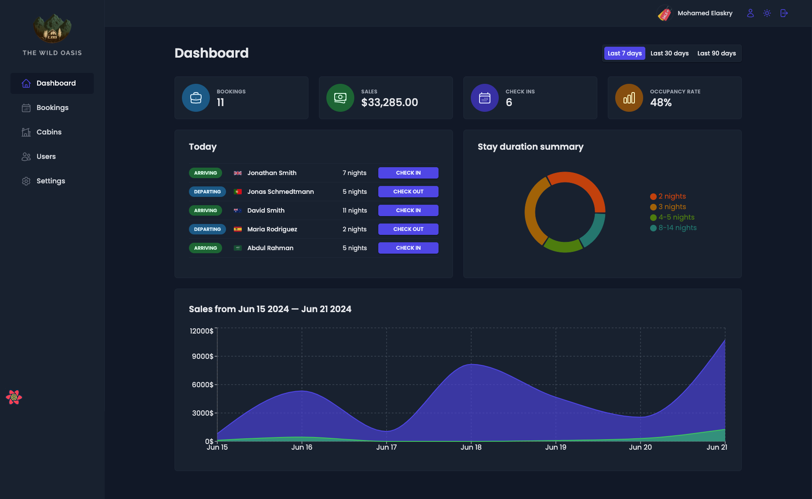
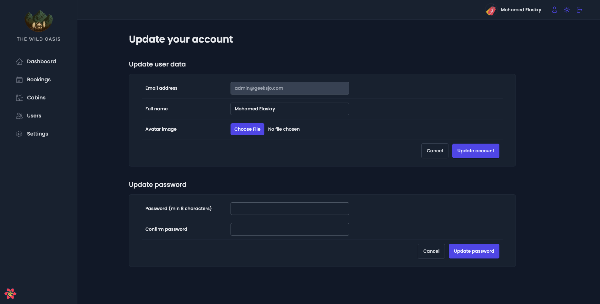
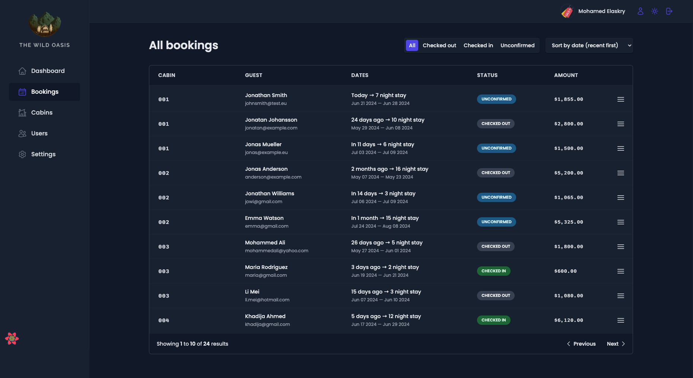
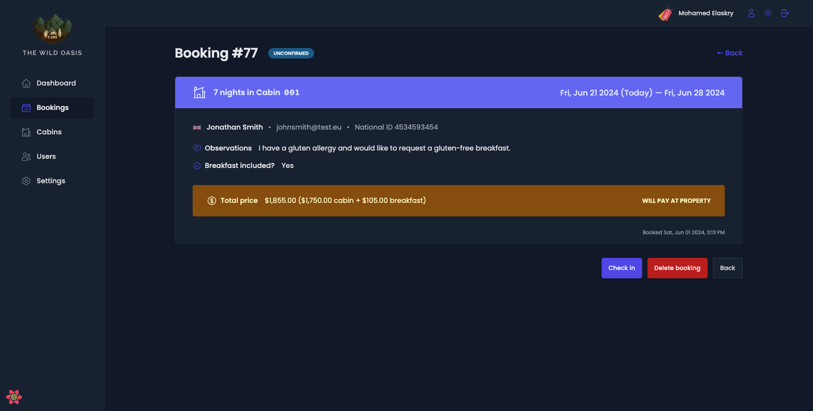
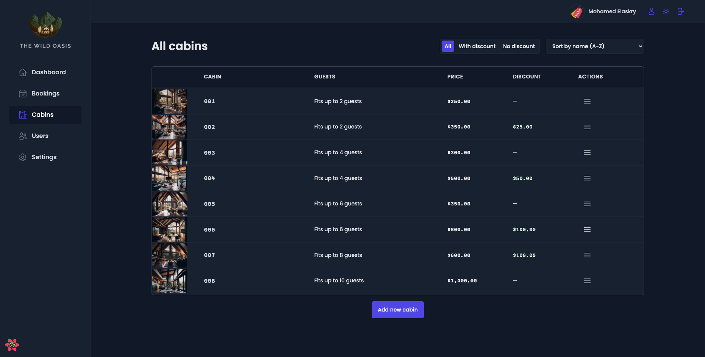
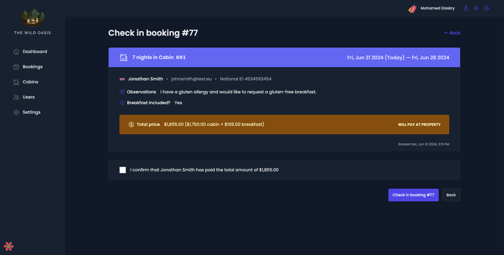
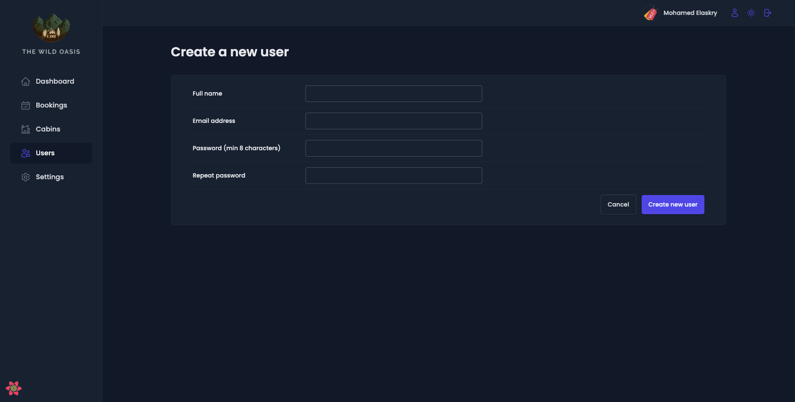
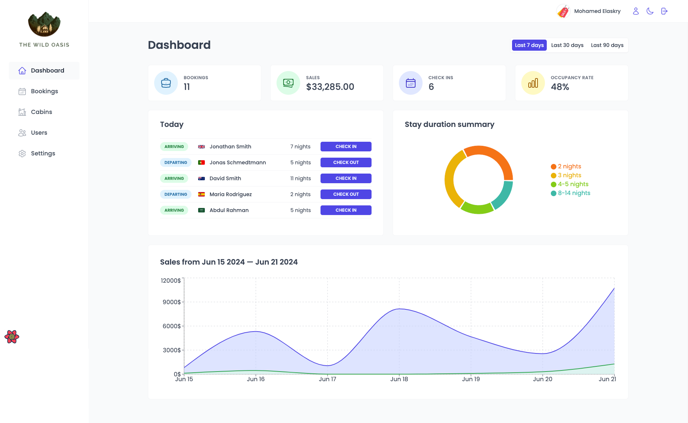

# Hotel Booking Dashboard

This is a hotel booking dashboard built with React.js. It provides a user-friendly interface for managing hotel bookings and reservations.

## Links

- [Live Demo on Vercel](https://elaskry-hotel.vercel.app)
- [Live Demo on Netlify](https://elaskry-hotel.netlify.app)

## Features

- **User Authentication**: Users can sign up, log in, and log out. Authentication is handled using [Supabase](https://supabase.com).

- **Admin Panel**: An admin panel is available for hotel administrators to manage hotel listings, room availability, and bookings.

- **Responsive Design**: The dashboard is designed to be responsive and optimized for various screen sizes, including desktop and mobile devices.

- **Real-time Data Updates**: The dashboard updates its data in real-time, ensuring that it is always up-to-date with the latest information.

- **Data Visualization**: The dashboard provides various visualizations to help users understand the hotel's booking trends and room availability.

- **User-friendly Interface**: The dashboard is designed to be user-friendly and intuitive, providing a smooth and intuitive experience for users.

- **Light and Dark Mode**: The dashboard supports light and dark mode, making it easier for users to adjust their viewing experience based on their preferred theme.

## Tools Used

- React.js
- Supabase
- React Query
- Styled Components
- React Hook Form
- React Hot Toast
- React Icons
- React Router DOM
- React Error Boundary
- Date Fns
- Recharts

## Screenshots

